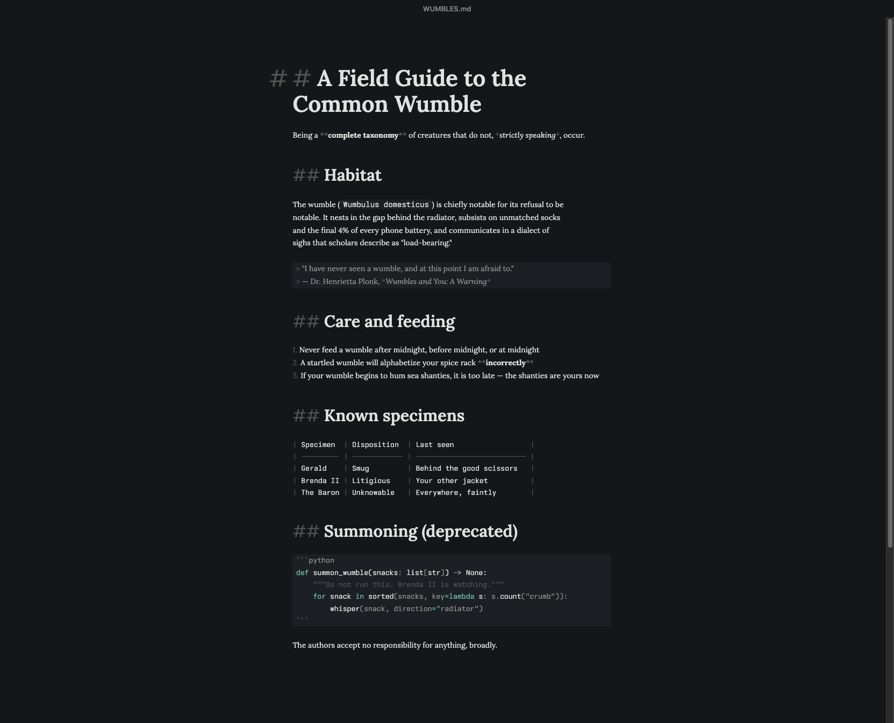
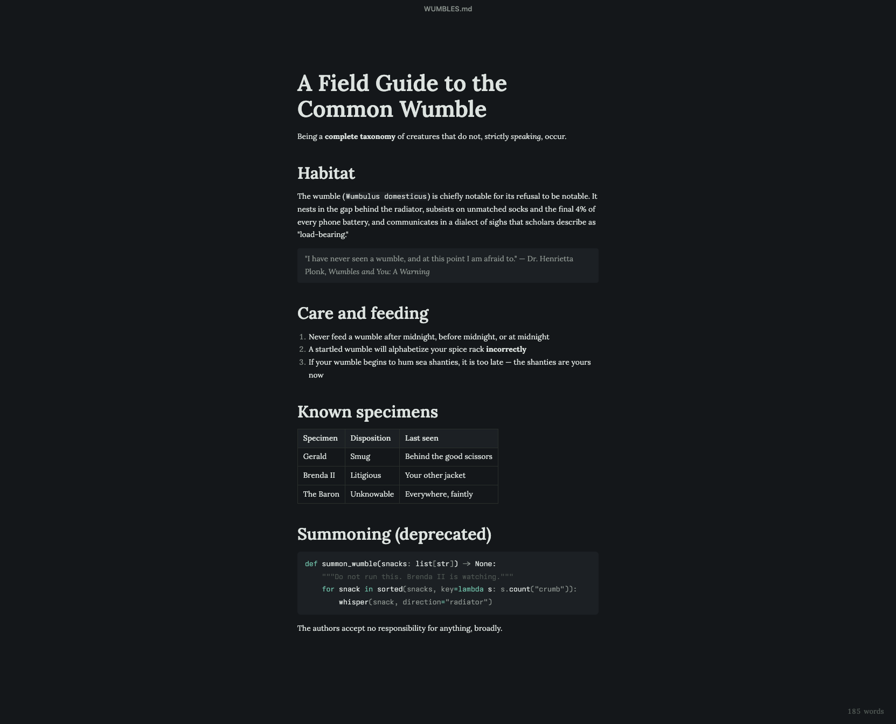

# Foolscap

A markdown editor. Free, open source, file-first, and unreasonably well-typeset.

[](https://github.com/seamoss/Foolscap/actions/workflows/ci.yml)



That's the editor, mid-edit, in the Plate theme. The `##` and `**` haven't
vanished — they've **receded**: still legible, still telling you what the
structure is, ready to breathe back up when your cursor arrives. The table's
pipes are aligned in the file itself, not just on screen.

Foolscap is a single beautiful writing surface for markdown files. The buffer is plain markdown text at all times — live preview is decorations over that text, never a document model — so the file on disk is always exactly what you wrote. What you see in the editor is what HTML and PDF export produce, because one pipeline drives all three:



## What it does

- Live preview of every markdown construct: headings (Fraunces, real optical sizing), emphasis, lists with hanging indents and real bullets, links (Cmd-click to open), Shiki-highlighted code fences, inline images, blockquotes, rules, and tables with cell navigation, a normalizing formatter, and hover column controls
- Atomic saves — temp file, fsync, rename; a crash can never truncate your manuscript
- External-change watching: clean buffers reload silently, dirty buffers get a choice
- Command palette (⌘K), find & replace, outline panel, typewriter and focus modes, word count
- Seven themes — from the house Ledger and Plate to GitHub, Vercel, and VS Code — plus load-your-own-CSS custom themes ([THEMING.md](THEMING.md))
- Ten writing faces, five serif and five sans; one font per page, and code keeps [Ioskeley Mono](https://github.com/ahatem/IoskeleyMono)
- Paste images from the clipboard into a sibling `assets/` folder
- Multi-window, with full session restore: `⌘Q` quits silently and the next launch sets the desk back up, unsaved drafts included
- Self-contained HTML export and typeset PDF export with the editor's real fonts

## Out of scope

Deliberately, and permanently for v1 — please don't file issues asking for:

- Vaults, workspaces, or folder-as-database concepts. Files are files.
- Sync, cloud, accounts, telemetry.
- Graph view, backlinks, wiki-links, tags.
- A plugin API. (Themes are not plugins; themes are in.)
- Collaborative editing.
- Mobile.
- AI features. There are forty of those. This one is about writing.
- Diagram rendering (Mermaid et al.). Fences show their source, beautifully — decided and closed.

## Platform

Foolscap is a **macOS app**. The Windows and Linux packaging config exists
and may even work, but nobody here runs it — it is untested and unsupported
for now.

## Install

Grab the DMG from [Releases](https://github.com/seamoss/Foolscap/releases) —
`arm64` for Apple Silicon, plain for Intel. Builds are currently unsigned,
so the first launch is right-click → **Open**. Foolscap checks Releases for
newer versions and mentions them in a single quiet toast; it never installs
anything itself.

## Building

```
pnpm install
pnpm dev        # run in development
pnpm test       # vitest
pnpm typecheck
pnpm pack:app   # unsigned local app build (dist/)
pnpm dist       # full installers
```

## License

[MIT](LICENSE)
